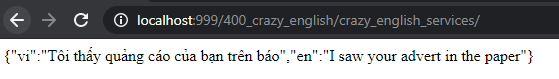
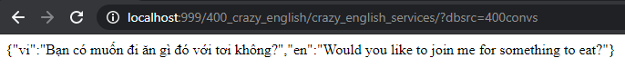
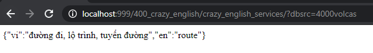

# Crazy_English
Crazy English

Make English learning be fun!

## Services

* Random between two Databases

> https://soiqualang.github.io/crazy_english/crazy_english_services/

* Random crazy English Conversations

> https://soiqualang.github.io/crazy_english/crazy_english_services/?dbsrc=400convs

* Random crazy English vocabularies

> https://soiqualang.github.io/crazy_english/crazy_english_services/?dbsrc=4000volcas

## 400 crazy English Conversations

* crazy_english_trans.txt
* crazy_english_trans.json

## 4000 crazy English vocabularies

* 4000 Core English Vocabulary Words.txt
* 4000_Core_English_Vocabulary_Words.json

## Make Json

https://www.csvjson.com/csv2json

https://stackoverflow.com/questions/1144705/best-way-to-store-a-key-value-array-in-javascript/1144737

https://stackoverflow.com/questions/2532218/pick-random-property-from-a-javascript-object

